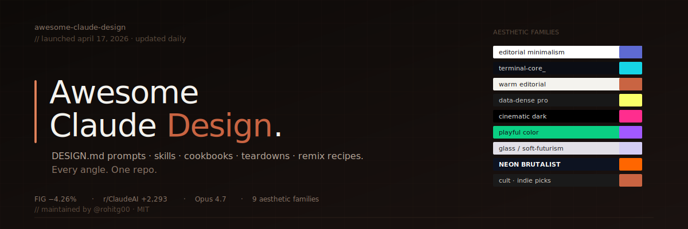
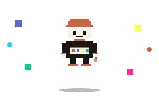
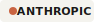
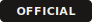
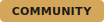
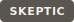

# Awesome Claude Design

> **Claude Design** — Anthropic Labs' AI design workspace. DESIGN.md files grouped by aesthetic family, remix recipes, prompt packs with example outputs, skills, video teardowns, and launch-week community signal.

<p align="center">
  
</p>

<p align="center">
  
</p>

<p align="center">
  <a href="https://awesome.re"></a>
  <a href="https://github.com/rohitg00/awesome-claude-design/stargazers"></a>
  <a href="https://github.com/rohitg00/awesome-claude-design/network/members"></a>
  <a href="https://github.com/rohitg00/awesome-claude-design/commits/main"></a>
  <a href="https://www.anthropic.com/news/claude-design-anthropic-labs"></a>
  <a href="https://www.anthropic.com"></a>
  <a href="LICENSE"></a>
</p>

<p align="center">
  
  
  
  
  
  
  
  
  
</p>

<p align="center">
  <a href="#1-editorial-minimalism"></a>
  <a href="#2-terminal-core"></a>
  <a href="#3-warm-editorial"></a>
  <a href="#4-data-dense-pro"></a>
  <a href="#5-cinematic-dark"></a>
  <a href="#6-playful-color"></a>
  <a href="#7-glass--soft-futurism"></a>
  <a href="#8-neon-brutalist"></a>
  <a href="#9-cult--indie-picks-non-fortune-500"></a>
</p>

<p align="center"><sub>Tags are SVGs under <a href="assets/tags/"><code>/assets/tags/</code></a> — fork and remix.</sub></p>

Claude Design shipped **April 17, 2026**. Figma closed **−4.26%** the same day. YouTube split between "RIP frontend developers" and "another slop feature." This repo collects both.

> **Heads up — typo-squat alert.** A repo named `anthropic-claude-design/claude-design` claiming to "download Claude Design" is NOT affiliated with Anthropic. The real product lives at [claude.ai/design](https://claude.ai/design) behind a Pro/Max/Team/Enterprise login. No download exists. Report the typo-squat.

## Contents

- [What Is Claude Design](#what-is-claude-design)
- [Feature Map](#feature-map)
- [Launch Timeline](#launch-timeline)
- [Official Resources](#official-resources)
- [X Signal](#x-signal)
- [DESIGN.md by Aesthetic Family](#designmd-by-aesthetic-family)
- [Remix Recipes](#remix-recipes)
- [Picker: What Should I Use](#picker-what-should-i-use)
- [Prompts & Cookbooks](#prompts--cookbooks)
- [Anti-Slop Kit](#anti-slop-kit)
- [Skills & Plugins](#skills--plugins)
- [Workflows & Recipes](#workflows--recipes)
- [Video Teardowns](#video-teardowns)
- [Comparisons](#comparisons)
- [Showcase](#showcase)
- [Community Takes](#community-takes)
- [FAQ](#faq)
- [Related OSS Projects](#related-oss-projects)
- [Contributing](#contributing)
- [License](#license)

---

## What Is Claude Design

Anthropic Labs product. Conversation-to-artifact loop for prototypes, design systems, slides, one-pagers, landing pages, marketing graphics, brand videos. Powered by **Claude Opus 4.7** (vision model). Research preview on **Pro, Max, Team, Enterprise** plans. Rolling out throughout launch day.

Three surfaces:
- **Prototypes** — from text, screenshot, Figma `.fig`, repo URL, or scraped live site
- **Design systems** — persistent per-project tokens/components via `DESIGN.md`; teams hold multiple
- **Collateral** — pitch decks, marketing pages, carousels, one-time posts, brand videos

## Feature Map

| Capability | Detail |
|---|---|
| Brand onboarding | Claude reads codebase + design files, builds system automatically on first run |
| Web capture | Grab live elements from your site so prototypes match production |
| File imports | DOCX, PPTX, XLSX, images, Figma `.fig`, repo URL, text |
| Inline comments | Comment on specific elements the way you would in Figma |
| Adjustment knobs | Live sliders for spacing, color, layout — apply across the design |
| Design-system coverage | Colors, typography, components, preview cards, working UI kit, exportable `SKILL.md` |
| Collaboration | Org-scoped sharing — private, view-only, edit access with group Claude chat |
| Export | Canva, PDF, PPTX, standalone HTML, shareable internal URL, saved folder |
| Code handoff | Bundle → Claude Code with one instruction (CSS vars + component stubs) |
| Frontier features | Voice, video, shaders, 3D, built-in AI outputs |
| Videos | Per @petergyang: "creates beautiful videos, more so than slides" |

## Launch Timeline

| Date | Event | Source |
|---|---|---|
| 2026-04-14 | The Information leaks Opus 4.7 + design tool | [r/singularity +889](https://www.reddit.com/r/singularity/comments/1slh72j/) |
| 2026-04-17 | Claude Design + Opus 4.7 ship in research preview | [anthropic.com](https://www.anthropic.com/news/claude-design-anthropic-labs) |
| 2026-04-17 | Official launch tweet | [@claudeai](https://x.com/claudeai/status/2045156267690213649) |
| 2026-04-17 | r/ClaudeAI launch thread hits 2,293 upvotes | [Reddit](https://www.reddit.com/r/ClaudeAI/comments/1so3k1y/) |
| 2026-04-17 | Figma closes −4.26% (second thread 1,763 upvotes) | [Reddit](https://www.reddit.com/r/ClaudeAI/comments/1so6z2t/) · [@brewmarkets](https://x.com/brewmarkets/status/2045175784554283228) |
| 2026-04-17 | r/FigmaDesign reports ~7% intraday dip | [Reddit](https://www.reddit.com/r/FigmaDesign/comments/1soc1ic/) |
| 2026-04-18 | Teardown wave: Isenberg, Malewicz, 02ui, Ray Fernando, WorldofAI, Vivek Mishra, AI for Work | See [Video Teardowns](#video-teardowns) |
| 2026-04-18 | @petergyang 16-min build: video + slides + website + app + design system | [Tweet](https://x.com/petergyang/status/2045527271650558383) |

## Official Resources

- [Launch — anthropic.com/news/claude-design-anthropic-labs](https://www.anthropic.com/news/claude-design-anthropic-labs)
- [Product — claude.ai/design](https://claude.ai/design)
- [Anthropic Labs](https://www.anthropic.com/labs)
- [Anthropic Prompt Library](https://docs.anthropic.com/en/resources/prompt-library/library) — Brand builder, Website wizard, Prose polisher, 40+ more
- [Claude Cookbooks — prompting_for_frontend_aesthetics.ipynb](https://github.com/anthropics/claude-cookbooks/blob/main/coding/prompting_for_frontend_aesthetics.ipynb)
- [Prompt engineering overview](https://docs.anthropic.com/en/docs/build-with-claude/prompt-engineering/overview)
- [Prompt generator (Console)](https://docs.anthropic.com/en/docs/build-with-claude/prompt-engineering/prompt-generator)

## X Signal

Launch-week reactions with receipts.

| Handle | Angle | Quote | Link |
|---|---|---|---|
| [@claudeai](https://x.com/claudeai/status/2045156267690213649) | Official | "Introducing Claude Design by Anthropic Labs. Powered by Claude Opus 4.7, our most capable vision model." | Tweet |
| [@petergyang](https://x.com/petergyang/status/2045527271650558383) | Hands-on PM | "Design system integration feels best in class for AI. Creates beautiful videos, more so than slides. Fun but burns through usage quickly." | Tweet |
| [@brewmarkets](https://x.com/brewmarkets/status/2045175784554283228) | Markets | "Figma stock is tumbling after Anthropic introduces Claude Design." | Tweet |

Submit more: handle, verbatim quote ≤280 chars, tweet URL, engagement numbers.

<p align="center"></p>

## DESIGN.md by Aesthetic Family

Not sorted by industry. Sorted by **visual character** — because that's how designers actually pick. Each family links to (1) a working `DESIGN.md` in `/design-md/<family>/`, (2) canonical external references, (3) a one-line swatch + type spec so you can eyeball fit before cloning.

**Shipped samples in this repo:** [warm/claude.md](design-md/warm/claude.md) · [terminal/ollama.md](design-md/terminal/ollama.md) · [editorial/linear.md](design-md/editorial/linear.md) · [data-dense/clickhouse.md](design-md/data-dense/clickhouse.md) · [cinematic/runway.md](design-md/cinematic/runway.md) · [playful/figma.md](design-md/playful/figma.md) · [glass/arc.md](design-md/glass/arc.md) · [brutalist/the-verge.md](design-md/brutalist/the-verge.md) · [indie/granola.md](design-md/indie/granola.md) · [remix/linear-x-claude.md](design-md/remix/linear-x-claude.md)

### 1. Editorial Minimalism

Calm neutrals, serif or narrow-grotesque headlines, generous line-height, single accent. Built for reading, pricing pages, docs.

| Brand | Swatch | Type | External reference |
|---|---|---|---|
| Linear | `#fff / #0f0f14 / #5e6ad2` | Inter / Söhne | [linear.app](https://linear.app) |
| Stripe | `#fff / #0a2540 / #635bff` | Sohne / Camphor | [stripe.com](https://stripe.com) |
| Vercel | `#fff / #000 / single grayscale ramp` | Geist | [vercel.com](https://vercel.com) |
| Mintlify | `#fff / #0c0c0e / green accent` | Inter reading-optimized | [mintlify.com](https://mintlify.com) |

### 2. Terminal-Core

Monospace everywhere, phosphor-green or amber on near-black, hard edges, CLI metaphors.

| Brand | Swatch | Type | External reference |
|---|---|---|---|
| Ollama | `#000 / #fff / no accent` | Mono | [ollama.com](https://ollama.com) |
| Warp | `#0b0d14 / #16d5e6 / #ff7a59` | Roobert + JetBrains Mono | [warp.dev](https://warp.dev) |
| Raycast | `#1d1d1f / #ff6363 / white` | Custom sans + mono | [raycast.com](https://raycast.com) |
| OpenCode | `#080808 / #d2d2d2 / green` | IBM Plex Mono | [opencode.ai](https://opencode.ai) |

### 3. Warm Editorial

Terracotta, cream, clay. Serif body, approachable, human. Claude's own brand sits here.

| Brand | Swatch | Type | External reference |
|---|---|---|---|
| Claude / Anthropic | `#f4f3ee / #c96442 / #191817` | Styrene / Tiempos | [anthropic.com](https://anthropic.com) |
| Notion | `#fff / #37352f / warm grays` | Segoe + Lyon serif | [notion.so](https://notion.so) |
| Resend | `#0a0a0a / #fff / mono accents` | Söhne + GT America Mono | [resend.com](https://resend.com) |
| Substack | `#fff / #1a1a1a / #ff6719` | Spectral + SF Pro | [substack.com](https://substack.com) |

### 4. Data-Dense Pro

Charts are the hero. Tight spacing, saturated categorical palette, fixed-width numerals, dark-first dashboards.

| Brand | Swatch | Type | External reference |
|---|---|---|---|
| ClickHouse | `#181818 / #faff69 / magenta` | Inter tabular | [clickhouse.com](https://clickhouse.com) |
| PostHog | `#1d4aff / #f9bd2b / #000` | Matter + Mono | [posthog.com](https://posthog.com) |
| Grafana | `#111217 / #f47c1b / multi-series` | Inter | [grafana.com](https://grafana.com) |
| Sentry | `#362d59 / #f6827d / #584774` | Rubik | [sentry.io](https://sentry.io) |
| Supabase | `#171717 / #3ecf8e` | Custom + mono | [supabase.com](https://supabase.com) |

### 5. Cinematic Dark

Film-grade gradients, oversized type, motion-forward, media-heavy hero. Built for AI products and creator tools.

| Brand | Swatch | Type | External reference |
|---|---|---|---|
| RunwayML | `#000 / saturated magenta + cyan` | Custom grotesque | [runwayml.com](https://runwayml.com) |
| ElevenLabs | `#0a0a0a / electric blue / wave motifs` | Inter | [elevenlabs.io](https://elevenlabs.io) |
| Minimax | `#000 / neon lime on charcoal` | Custom + mono | [minimax.ai](https://minimax.ai) |
| Midjourney | `#000 / earth tones + lilac` | Editorial serif | [midjourney.com](https://midjourney.com) |

### 6. Playful Color

High-saturation, illustrated accents, rounded corners, decorative shapes. Consumer-friendly.

| Brand | Swatch | Type | External reference |
|---|---|---|---|
| Figma | `#0acf83 / #f24e1e / #a259ff / #ff7262 / #1abcfe` | Inter + Whyte | [figma.com](https://figma.com) |
| Clay | `#f6e9c9 / organic shapes / soft gradients` | Söhne | [clay.com](https://clay.com) |
| Duolingo | `#58cc02 / #fff / #ff4b4b` | DIN Rounded | [duolingo.com](https://duolingo.com) |
| Mailchimp | `#ffe01b / #000` | Cooper Hewitt + GT America | [mailchimp.com](https://mailchimp.com) |
| Cal.com | `#292929 / #fff / single accent` | Inter | [cal.com](https://cal.com) |

### 7. Glass / Soft-Futurism

Frosted blur, layered translucency, soft gradients, Apple-adjacent. Premium consumer feel.

| Brand | Swatch | Type | External reference |
|---|---|---|---|
| Apple | `#fff / #1d1d1f / system colors` | SF Pro | [apple.com](https://apple.com) |
| Arc Browser | `#fff / radial pastel gradients` | Custom | [arc.net](https://arc.net) |
| Airbnb | `#fff / #ff385c / #222` | Cereal | [airbnb.com](https://airbnb.com) |
| Granola | `#faf8f2 / warm glass` | Editorial serif | [granola.ai](https://granola.ai) |
| Spotify | `#000 / #1db954` | Circular | [spotify.com](https://spotify.com) |

### 8. Neon Brutalist

Hard edges, deliberate-ugly type mixing, oversized numerals, saturated single hue. Statement pieces.

| Brand | Swatch | Type | External reference |
|---|---|---|---|
| Bugatti | `#0d1321 / electric blue / chrome` | Custom + GT America | [bugatti.com](https://bugatti.com) |
| PlayStation | `#000 / full-spectrum prism` | SST | [playstation.com](https://playstation.com) |
| The Verge | `#ff6600 / #000 / #fff` | Polysans + editorial serif | [theverge.com](https://theverge.com) |
| Pitchfork | `#fff / #000 / #ff5d1f` | Editorial serif | [pitchfork.com](https://pitchfork.com) |

### 9. Cult / Indie Picks (non-Fortune-500)

Brands VoltAgent's catalog does NOT cover — indie SaaS, cult tools, magazines, museums, game studios. Maintainer bias: these are the ones worth cloning.

| Brand | Why | External reference |
|---|---|---|
| Thesephist / Ink & Switch | Research-publication aesthetic | [thesephist.com](https://thesephist.com) |
| Paradigm | Crypto-firm minimal serif | [paradigm.xyz](https://paradigm.xyz) |
| Criterion Collection | Film archive editorial | [criterion.com](https://criterion.com) |
| A24 | Cinema brand-as-artifact | [a24films.com](https://a24films.com) |
| Letterboxd | Dark cinephile social | [letterboxd.com](https://letterboxd.com) |
| ProPublica | Investigative journalism density | [propublica.org](https://propublica.org) |
| Dimension.dev | Dev-tool soft-gradient | [dimension.dev](https://dimension.dev) |
| Granola | AI notetaker warmth | [granola.ai](https://granola.ai) |
| Superhuman | Premium email minimalism | [superhuman.com](https://superhuman.com) |
| Obsidian | Personal-knowledge dark | [obsidian.md](https://obsidian.md) |

### External catalogs

- [**VoltAgent/awesome-claude-design**](https://github.com/VoltAgent/awesome-claude-design)  — brand DESIGN.md files, industry-sorted
- [**VoltAgent/awesome-design-md**](https://github.com/VoltAgent/awesome-design-md)  — Stitch-format collection, tool-agnostic
- [**google-labs-code/design-md**](https://github.com/VoltAgent/awesome-agent-skills) — canonical DESIGN.md skill from the format's origin

<p align="center"></p>

## Remix Recipes

Single-brand clones get generic fast. Mix tokens across families for novel looks.

| Name | Recipe | Feel |
|---|---|---|
| **Linear × Claude** | Linear's typography + Claude's terracotta accent + warm neutrals | Editorial SaaS with a soul |
| **Warp × Sentry** | Warp's mono grid + Sentry's lilac → purple | Developer-tool dashboard that doesn't feel cold |
| **Stripe × A24** | Stripe's layout discipline + A24's poster boldness | Fintech pitch deck with personality |
| **Vercel × Pitchfork** | Vercel's grayscale ramp + Pitchfork's orange | Editorial docs site |
| **Granola × Criterion** | Granola's warmth + Criterion's editorial rigor | Premium note app with gravitas |
| **Ollama × ElevenLabs** | Terminal mono + cinematic dark gradients | CLI tool landing page |
| **Notion × Duolingo** | Notion's neutrals + Duolingo's greens | Friendly education SaaS |

Ship your remix: `/design-md/remix/<name>.md` + screenshot. PR it.

## Picker: What Should I Use

Three questions. Pick a family.

1. **Is your product read-heavy or scan-heavy?**
   - Read-heavy → [Editorial Minimalism](#1-editorial-minimalism) or [Warm Editorial](#3-warm-editorial)
   - Scan-heavy → [Data-Dense Pro](#4-data-dense-pro) or [Terminal-Core](#2-terminal-core)

2. **Who's the user?**
   - Developer → [Terminal-Core](#2-terminal-core) or [Data-Dense Pro](#4-data-dense-pro)
   - Designer / creator → [Cinematic Dark](#5-cinematic-dark) or [Playful Color](#6-playful-color)
   - Consumer → [Glass / Soft-Futurism](#7-glass--soft-futurism) or [Playful Color](#6-playful-color)
   - Prosumer → [Warm Editorial](#3-warm-editorial)

3. **Does the brand need to feel like it took courage?**
   - Yes → [Neon Brutalist](#8-neon-brutalist) or [Cult / Indie Picks](#9-cult--indie-picks-non-fortune-500)
   - No → Stay in families 1-7

## Prompts & Cookbooks

### Official (Anthropic)

- [Anthropic Prompt Library](https://docs.anthropic.com/en/resources/prompt-library/library) — 40+ prompts including **Brand builder**, **Website wizard**, **Prose polisher**
- [claude-cookbooks / prompting_for_frontend_aesthetics.ipynb](https://github.com/anthropics/claude-cookbooks/blob/main/coding/prompting_for_frontend_aesthetics.ipynb) — official anti-slop notebook
- [System prompts release notes](https://docs.anthropic.com/en/release-notes/system-prompts)

### Community gists & prompt repos

- [**superdesigndev/superdesign**](https://github.com/superdesigndev/superdesign)  — open-source design agent in the IDE by [@jasonzhou1993](https://x.com/jasonzhou1993) and [@jackjack_eth](https://x.com/jackjack_eth). Parallel Claude Code agents, infinite canvas UX. [Show HN](https://news.ycombinator.com/item?id=44376003)
- [**jonthebeef/superdesign-mcp-claude-code**](https://github.com/jonthebeef/superdesign-mcp-claude-code)  — MCP server wiring SuperDesign into Claude Code, no API key
- [**Owl-Listener/designer-skills**](https://github.com/Owl-Listener/designer-skills)  — Designer Skills Collection by MC Dean. MIT
- [**Owl-Listener/designpowers**](https://github.com/Owl-Listener/designpowers)  — specialist design agents, Direct + Auto modes. MIT
- [**saifyxpro/ui-ux-design-pro-skill**](https://github.com/saifyxpro/ui-ux-design-pro-skill)  — styles, palettes, fonts, reasoning rules, platform templates
- [**nextlevelbuilder/ui-ux-pro-max-skill**](https://github.com/nextlevelbuilder/ui-ux-pro-max-skill)  — professional UI/UX across platforms
- [**alirezarezvani/claude-skills**](https://github.com/alirezarezvani/claude-skills)  — skills across engineering, marketing, product, compliance
- [**NicholasSpisak — Design with Claude Code**](https://gist.github.com/NicholasSpisak/7cb9db221b0b7c4c4aaf9ffca21a847c) — `design.md` prompt with three design-professional personas in live debate
- [**abhishekray07/claude-md-templates**](https://github.com/abhishekray07/claude-md-templates)  — CLAUDE.md + `api-design.md` rule template
- [**smartwhale8/claude-playbook**](https://github.com/smartwhale8/claude-playbook)  — production `.claude/` scaffolding, GitHub template
- [**VoltAgent/awesome-agent-skills**](https://github.com/VoltAgent/awesome-agent-skills) — 1000+ skills incl. `design-md`, `enhance-prompt`, `react-components`, `shadcn-ui`
- [**daymade/claude-code-skills**](https://github.com/daymade/claude-code-skills) — production-ready Claude Code skills marketplace

### Prompt packs shipped here (`/prompts`)

Every pack includes the full prompt, an example run with expected output, quality checks, and variations.

| Pack | Purpose | File |
|---|---|---|
| `brand-to-design-md` | URL → full DESIGN.md with 9 canonical sections | [`/prompts/brand-to-design-md.md`](prompts/brand-to-design-md.md) |
| `audit-live-site` | URL → scored audit (hierarchy, spacing, a11y, AI-slop) + punch list | [`/prompts/audit-live-site.md`](prompts/audit-live-site.md) |
| `3-designer-debate` | Three-voice critique with synthesis + minority reports | [`/prompts/3-designer-debate.md`](prompts/3-designer-debate.md) |
| `remix-two-brands` | Combine two DESIGN.md files with explicit token arbitration | [`/prompts/remix-two-brands.md`](prompts/remix-two-brands.md) |
| `family-picker` | 3 questions → recommended family + 2 reference DESIGN.md files | [`/prompts/family-picker.md`](prompts/family-picker.md) |

Index: [`/prompts/README.md`](prompts/README.md)

## Anti-Slop Kit

Drop this fragment into Claude Design's system prompt or any Claude Code project. Sourced from Anthropic's [frontend aesthetics cookbook](https://github.com/anthropics/claude-cookbooks/blob/main/coding/prompting_for_frontend_aesthetics.ipynb):

```
NEVER use generic AI-generated aesthetics:
- Overused font families (Inter, Roboto, Arial, system fonts)
- Cliched color schemes (purple gradients on white or dark backgrounds)
- Predictable layouts and component patterns
- Cookie-cutter design that lacks context-specific character

DO use:
- Unique fonts chosen for the brand, not defaults
- Cohesive colors and themes grounded in the product's story
- Animations for effects and micro-interactions
- Context-specific character in every component
```

Malewicz's [teardown](https://www.youtube.com/watch?v=IkspcJdeP3U)  opens by flagging Claude Design's own logo as "generic, color palette" — exactly the trap this prompt is built to avoid.

## Skills & Plugins

Claude Code skills and SkillKit plugins that pair with Claude Design.

- [**design-shotgun**](https://github.com/rohitg00/skillkit) — generate N variants, compare side-by-side
- [**design-html**](https://github.com/rohitg00/skillkit) — finalize mockup → production HTML/CSS
- [**design-review**](https://github.com/rohitg00/skillkit) — designer's-eye QA, AI-slop detection
- [**design-consultation**](https://github.com/rohitg00/skillkit) — full system proposal (aesthetic, typography, color, motion)
- [**plan-design-review**](https://github.com/rohitg00/skillkit) — plan-mode critique before implementation
- [**plan-devex-review**](https://github.com/rohitg00/skillkit) — DX audit for developer-facing UI
- [**google-labs-code/design-md**](https://github.com/VoltAgent/awesome-agent-skills) — canonical Stitch DESIGN.md generator
- [**superdesign-mcp**](https://github.com/jonthebeef/superdesign-mcp-claude-code) — SuperDesign as Claude Code MCP server

Install via SkillKit: `npx skillkit install design-shotgun`

## Workflows & Recipes

End-to-end flows in `/recipes/<name>.md`.

1. **Landing page in 20 minutes** — DESIGN.md → Claude Design → Claude Code → Vercel
2. **Figma file → DESIGN.md** — drag `.fig` in chat, extract tokens, reuse
3. **Existing repo → design system** — point Claude at your CSS, get canonical DESIGN.md back
4. **Wireframe → hi-fi** — low-fi sketch to pixel-perfect comp
5. **Pitch deck from README** — 12-slide deck from a project README
6. **Brand extraction** — URL → DESIGN.md describing a competitor's system
7. **Design-system governance** — lock tokens as `SKILL.md` for every future project
8. **Web capture → prototype** — use the native capture tool on your live site
9. **16-minute everything build** — per @petergyang: video + slides + website + app + initial system
10. **Two-brand remix** — combine tokens from two DESIGN.md files coherently
11. **Claude Design → Canva export** — designer collaboration pathway
12. **Org-wide design-system sharing** — view-only URL, group-chat edit mode

<p align="center"></p>

## Video Teardowns

Click thumbnail. View counts refresh live via shields.io.

<table>
<tr>
<td align="center" width="25%">
<a href="https://www.youtube.com/watch?v=IkspcJdeP3U"></a><br>
<b>Malewicz</b><br>
 <br>
<sub>Skeptical senior-designer teardown</sub>
</td>
<td align="center" width="25%">
<a href="https://www.youtube.com/watch?v=o4jIKc_DIoM"></a><br>
<b>02ui · Murat Bayral</b><br>
 <br>
<sub>vs Lovable head-to-head</sub>
</td>
<td align="center" width="25%">
<a href="https://www.youtube.com/watch?v=uhQfErAzdiA"></a><br>
<b>WorldofAI</b><br>
 <br>
<sub>Hype walkthrough</sub>
</td>
<td align="center" width="25%">
<a href="https://www.youtube.com/watch?v=Qct36RA3y9k"></a><br>
<b>Ray Fernando</b><br>
 <br>
<sub>Live blog redesign</sub>
</td>
</tr>
<tr>
<td align="center" width="25%">
<a href="https://www.youtube.com/watch?v=A2eEv3KYGPg"></a><br>
<b>Vivek Mishra</b><br>
 <br>
<sub>Launch-day walkthrough</sub>
</td>
<td align="center" width="25%">
<a href="https://www.youtube.com/watch?v=4q2F4zblOLQ"></a><br>
<b>AI for Work</b><br>
 <br>
<sub>System from prompt</sub>
</td>
<td align="center" width="25%">
<a href="https://www.youtube.com/watch?v=vyLaimDeK_g"></a><br>
<b>Greg Isenberg</b><br>
 <br>
<sub>Hands-on edges</sub>
</td>
<td align="center" width="25%">
<a href="https://www.youtube.com/watch?v=Hcvkc1XUhMg"></a><br>
<b>Ramanpal Singh</b><br>
 <br>
<sub>Beginner tutorial</sub>
</td>
</tr>
</table>

## Comparisons

| Feature | Claude Design | [Figma Make](https://www.figma.com/make) | [Lovable](https://lovable.dev) | [v0](https://v0.dev) | [Stitch](https://stitch.withgoogle.com) | [SuperDesign](https://github.com/superdesigndev/superdesign) |
|---|---|---|---|---|---|---|
| Prompt → hi-fi | Yes | Yes | Yes | Yes | Yes | Yes |
| DESIGN.md native | **Yes** | No | Partial | No | Originated | Yes |
| Screenshot → system | Yes | No | Partial | No | Yes | Yes |
| Figma `.fig` import | Yes | Native | Yes | Partial | No | No |
| Web capture on live site | **Native** | No | Partial | No | No | Partial |
| Inline comments / knobs | **Yes** | Yes | No | No | No | No |
| Persistent per-project tokens | **Yes** | Yes | Partial | No | No | Yes |
| Org-scoped collab + group chat | **Yes** | Yes | No | No | No | No |
| Export paths | Canva/PDF/PPTX/HTML | Figma | Full-stack app | React | HTML | Local files |
| Multi-system per team | **Yes** | Yes | No | No | No | Yes |
| Open source | No | No | No | No | No | **Yes (MIT)** |
| Runs in your IDE | No | No | No | No | No | **Yes** |
| Underlying model | Opus 4.7 | GPT-based | Claude/GPT | GPT + Claude | Gemini | BYO |
| Pricing | Pro/Max/Team/Ent. | Figma Pro add-on | Freemium | Freemium | Free beta | Free |

Launch-week consensus: **Claude Design** wins design-system coherence, web capture, collaboration. **Lovable** wins full-stack shipping. **Figma Make** is safest for Figma teams. **Stitch** is strongest for pure token generation. **SuperDesign** is the only open-source option that lives inside the IDE.

## Showcase

Submit via PR — live URL, the DESIGN.md used, 2–3 screenshots, one-paragraph story.

## Community Takes

### Hype

> "Would suck to be Figma right now."
> — [r/ClaudeAI launch thread](https://www.reddit.com/r/ClaudeAI/comments/1so3k1y/)

> "After 29 years of being a designer, this is the only better way of working."
> — [AI for Work](https://www.youtube.com/watch?v=4q2F4zblOLQ)

> "The design system integration feels best in class for AI."
> — [@petergyang](https://x.com/petergyang/status/2045527271650558383)

### Pushback

> "Just tested it. This is only hype for people that never worked with real UX/UI designers. Another slop feature that will burn tokens."
> — [r/ClaudeAI](https://www.reddit.com/r/ClaudeAI/comments/1so3k1y/)

> "Anthropic is saying 'look at this hand, see the coin?' — I'm going to open the hand, and the coin is not there. But it was never there. The whole goal was so you're not looking at the other hand while they're taking your subscription money."
> — [Malewicz](https://www.youtube.com/watch?v=IkspcJdeP3U)

> "Was Google Stitch or Microsoft Designer or Template Monster the quality of a mid-level designer? No. Is this?"
> — Malewicz, same video

### The market

Figma (NYSE: FIG) closed **−4.26%** on launch day. Intraday low ~**−7%** per r/FigmaDesign. Adobe unchanged.

### The fine print

> "Fun but burns through usage quickly."
> — [@petergyang](https://x.com/petergyang/status/2045527271650558383)

Early Opus 4.7 hallucination reports on long tasks: [r/ClaudeCode thread](https://www.reddit.com/r/ClaudeCode/comments/1so9uta/) — "$120 of API credits, by god is it bad."

## FAQ

**Does Claude Design replace Figma?**
Not today. Replaces the first-draft stage (wireframes, comps, pitch decks). Teams still round-trip through Figma for collab, dev handoff, plugins.

**Opus 4.7 required?**
Bundled at launch. Sonnet 4.6 works, produces weaker systems. Long-task hallucination reports are real.

**Figma file import?**
Yes — drag `.fig` in chat. Single pages work well; multi-file libraries hit-or-miss at launch.

**Price?**
Bundled in Pro / Max / Team / Enterprise. Per-seat Team pricing not yet published.

**Data training?**
Per Anthropic's policy: no, not by default for paid tiers. Verify on [anthropic.com/legal/privacy](https://www.anthropic.com/legal/privacy) before shipping sensitive work.

**Videos?**
Yes. Per @petergyang, "creates beautiful videos, more so than slides." Greg Isenberg less impressed. Try and decide.

**Open-source alternative?**
[SuperDesign](https://github.com/superdesigndev/superdesign) — runs in your IDE, MIT, BYO model.

**Is `anthropic-claude-design/claude-design` on GitHub real?**
No. Typo-squat. Claude Design lives at [claude.ai/design](https://claude.ai/design) behind a paid login. No download exists.

## Related OSS Projects

| Repo | Stars | What |
|---|---|---|
| [superdesigndev/superdesign](https://github.com/superdesigndev/superdesign) |  | Open-source AI design agent in the IDE, MIT |
| [jonthebeef/superdesign-mcp-claude-code](https://github.com/jonthebeef/superdesign-mcp-claude-code) |  | SuperDesign as Claude Code MCP, no API key |
| [Owl-Listener/designer-skills](https://github.com/Owl-Listener/designer-skills) |  | Designer Skills Collection by MC Dean, MIT |
| [Owl-Listener/designpowers](https://github.com/Owl-Listener/designpowers) |  | Specialist design agents, Direct + Auto modes, MIT |
| [VoltAgent/awesome-claude-design](https://github.com/VoltAgent/awesome-claude-design) |  | Brand DESIGN.md catalog, industry-sorted |
| [VoltAgent/awesome-design-md](https://github.com/VoltAgent/awesome-design-md) |  | Stitch-format DESIGN.md collection |
| [VoltAgent/awesome-agent-skills](https://github.com/VoltAgent/awesome-agent-skills) |  | Skills incl. `design-md`, `shadcn-ui`, `react-components` |
| [saifyxpro/ui-ux-design-pro-skill](https://github.com/saifyxpro/ui-ux-design-pro-skill) |  | Styles, palettes, fonts, CLI |
| [nextlevelbuilder/ui-ux-pro-max-skill](https://github.com/nextlevelbuilder/ui-ux-pro-max-skill) |  | Multi-platform UI/UX skill |
| [alirezarezvani/claude-skills](https://github.com/alirezarezvani/claude-skills) |  | Skills across engineering, product, marketing |
| [daymade/claude-code-skills](https://github.com/daymade/claude-code-skills) |  | Claude Code skills marketplace |
| [abhishekray07/claude-md-templates](https://github.com/abhishekray07/claude-md-templates) |  | CLAUDE.md + rules best practices |
| [smartwhale8/claude-playbook](https://github.com/smartwhale8/claude-playbook) |  | Production `.claude/` GitHub template |
| [NicholasSpisak gist](https://gist.github.com/NicholasSpisak/7cb9db221b0b7c4c4aaf9ffca21a847c) | — | Three-designer debate prompt |
| [anthropics/claude-cookbooks](https://github.com/anthropics/claude-cookbooks) |  | Official Anthropic notebooks |
| [rohitg00/awesome-claude-plugins](https://github.com/rohitg00/awesome-claude-plugins) |  | Claude Code plugin ecosystem |
| [rohitg00/awesome-claude-code-toolkit](https://github.com/rohitg00/awesome-claude-code-toolkit) |  | Hooks, skills, slash commands |
| [rohitg00/skillkit](https://github.com/rohitg00/skillkit) |  | Universal CLI for skills across many agents |
| [hesreallyhim/awesome-claude-code](https://github.com/hesreallyhim/awesome-claude-code) |  | General Claude Code resources |
| [github.com/topics/claude-design](https://github.com/topics/claude-design) | — | Live topic feed |

## Contributing

Bar: **would a working designer or engineer find this useful in the next 48 hours?**

**Accepted:** original DESIGN.md files in any aesthetic family · remix recipes (two-brand combos) · prompt packs with before/after screenshots · workflow recipes you actually ran · video teardowns > 2K views OR with substantive critique · comparison data with receipts · X-handle quotes with links + engagement · screenshots/GIFs of real output.

**Rejected:** affiliate links · screenshots without reproducible prompts · "cool thing!" with no context · re-packaged VoltAgent entries (link upstream) · slop · emoji-heavy headers · typo-squat repos.

**PR template:** title `[family] brand — one-line value`. Body = swatch + type + reference link + reproducibility notes.

See [CONTRIBUTING.md](CONTRIBUTING.md).

## License

[MIT](LICENSE). Use, fork, remix, ship.

Not affiliated with Anthropic. "Claude" and "Claude Design" are trademarks of Anthropic PBC. Brand names in referenced DESIGN.md files belong to their respective owners — included for educational commentary only.

---

<p align="center"></p>

<p align="center"></p>

<p align="center">
  Maintained by <a href="https://github.com/rohitg00">@rohitg00</a>. PRs welcome.
</p>
